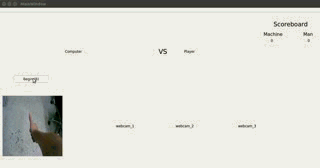

# EgoGesture Rock-Scissors-Paper Game     

### Introduction       
This is an egocentric view Rock-Scissors-Paper game, using a caffemodel to do the 4-class classification task (rock scissors paper or background). The interface is built buy Qt Creator on an [Jetson TK1](https://elinux.org/Jetson_TK1) board.    

Of course, you can easily move the interface to any system with caffe environment.        

We use MobileNet as our classification network, which requires around 200MB memory (The input image is 224\*224). Your can train a new model using the EgoGesture dataset that I will introduce below if needed.       

The following is a demo:          
          

### Dataset     
I choose 3 kinds of gesture from our [EgoGesture dataset](http://www.hcii-lab.net/data/SCUTEgoGesture/index.htm) to train the caffemodel. EgoGesture dataset totally includes 16 kinds of gesture, 11 single hand gesture and 5 double hand gesture.       

Your can utilize more kinds of gesture to train a new model you need.

### Attention      
Note that:
1. The caffemodel I used isn't very robust. For example, I haven't done any data augmentation, and all the training images are right hand images. So if you use left hand during gaming, it will be challenging for the model to classify your gesture correctly. Of course, you can train a new model using our EgoGesture dataset by yourself.
2. Because there is no rock gesture in EgoGesture dataset, i use SingleGood to replace it.
3. Our EgoGesture dataset also contains fingertip and finger joint coordinates, so you can use it to do more interesting things like fingertip detection, etc.

